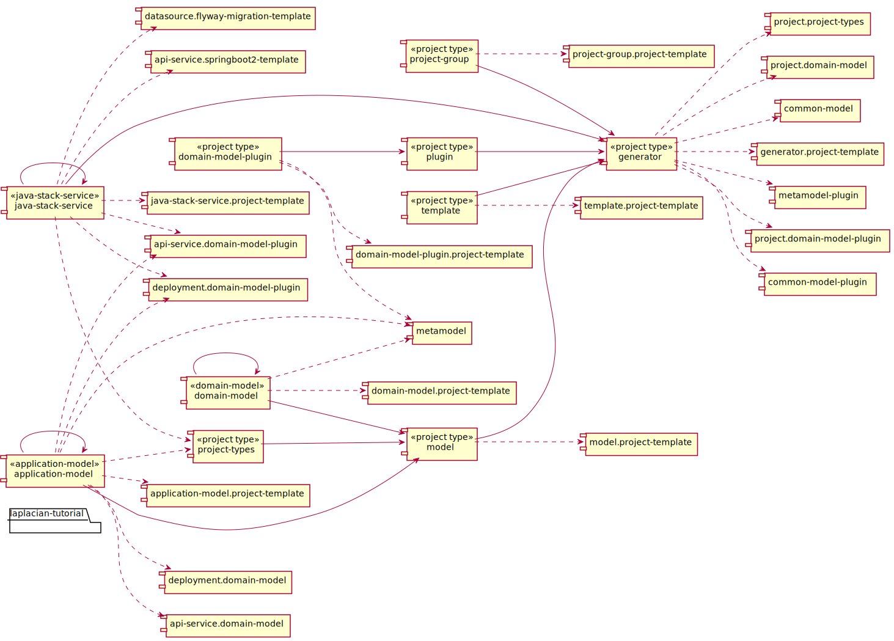

<!-- @head-content@ -->
# laplacian-tutorial/projects

laplacian-tutorial projects.

*Read this in other languages*: [[English](README.md)] [[简体中文](README_zh.md)]
<!-- @head-content@ -->

<!-- @toc@ -->
## Table of contents
- [概要](#概要)

  * [プロジェクト依存関係](#プロジェクト依存関係)

- [インデックス](#インデックス)

  * [スクリプト一覧](#スクリプト一覧)

  * [ソースコード一覧](#ソースコード一覧)

<!-- @toc@ -->

<!-- @main-content@ -->
## 概要

### プロジェクト依存関係

以下の図は、各プロジェクト間の依存関係を表したグラフです。

## インデックス

### スクリプト一覧

- [./script/create-new-domain-model-plugin-project.sh](<./scripts/create-new-domain-model-plugin-project.sh>)

  新規のdomain-model-pluginプロジェクトをこのプロジェクトグループに追加します。

  > Usage: create-new-domain-model-plugin-project.sh [OPTION]...
  >
  > -h, --help
  >
  >   このコマンドの使用方法を表示します。
  >   
  > -v, --verbose
  >
  >   より詳細なコマンドの実行情報を表示します。
  >   
  > , --project-name [VALUE]
  >
  >   新規プロジェクト名
  >    (Default: domain-model-plugin)
  > , --project-version [VALUE]
  >
  >   初期バージョン番号
  >    (Default: 0.0.1)
  > , --namespace [VALUE]
  >
  >   名前空間
  >    (Default: laplacian.tutorial)
- [./script/create-new-domain-model-project.sh](<./scripts/create-new-domain-model-project.sh>)

  新規のdomain-modelプロジェクトをこのプロジェクトグループに追加します。

  > Usage: create-new-domain-model-project.sh [OPTION]...
  >
  > -h, --help
  >
  >   このコマンドの使用方法を表示します。
  >   
  > -v, --verbose
  >
  >   より詳細なコマンドの実行情報を表示します。
  >   
  > , --project-name [VALUE]
  >
  >   新規プロジェクト名
  >    (Default: domain-model)
  > , --project-version [VALUE]
  >
  >   初期バージョン番号
  >    (Default: 0.0.1)
  > , --namespace [VALUE]
  >
  >   名前空間
  >    (Default: laplacian.tutorial)
- [./script/create-new-generator-project.sh](<./scripts/create-new-generator-project.sh>)

  新規のgeneratorプロジェクトをこのプロジェクトグループに追加します。

  > Usage: create-new-generator-project.sh [OPTION]...
  >
  > -h, --help
  >
  >   このコマンドの使用方法を表示します。
  >   
  > -v, --verbose
  >
  >   より詳細なコマンドの実行情報を表示します。
  >   
  > , --project-name [VALUE]
  >
  >   新規プロジェクト名
  >    (Default: generator)
  > , --project-version [VALUE]
  >
  >   初期バージョン番号
  >    (Default: 0.0.1)
  > , --namespace [VALUE]
  >
  >   名前空間
  >    (Default: laplacian.tutorial)
- [./script/create-new-model-project.sh](<./scripts/create-new-model-project.sh>)

  新規のmodelプロジェクトをこのプロジェクトグループに追加します。

  > Usage: create-new-model-project.sh [OPTION]...
  >
  > -h, --help
  >
  >   このコマンドの使用方法を表示します。
  >   
  > -v, --verbose
  >
  >   より詳細なコマンドの実行情報を表示します。
  >   
  > , --project-name [VALUE]
  >
  >   新規プロジェクト名
  >    (Default: model)
  > , --project-version [VALUE]
  >
  >   初期バージョン番号
  >    (Default: 0.0.1)
  > , --namespace [VALUE]
  >
  >   名前空間
  >    (Default: laplacian.tutorial)
- [./script/create-new-plugin-project.sh](<./scripts/create-new-plugin-project.sh>)

  新規のpluginプロジェクトをこのプロジェクトグループに追加します。

  > Usage: create-new-plugin-project.sh [OPTION]...
  >
  > -h, --help
  >
  >   このコマンドの使用方法を表示します。
  >   
  > -v, --verbose
  >
  >   より詳細なコマンドの実行情報を表示します。
  >   
  > , --project-name [VALUE]
  >
  >   新規プロジェクト名
  >    (Default: plugin)
  > , --project-version [VALUE]
  >
  >   初期バージョン番号
  >    (Default: 0.0.1)
  > , --namespace [VALUE]
  >
  >   名前空間
  >    (Default: laplacian.tutorial)
- [./script/create-new-project-group-project.sh](<./scripts/create-new-project-group-project.sh>)

  新規のproject-groupプロジェクトをこのプロジェクトグループに追加します。

  > Usage: create-new-project-group-project.sh [OPTION]...
  >
  > -h, --help
  >
  >   このコマンドの使用方法を表示します。
  >   
  > -v, --verbose
  >
  >   より詳細なコマンドの実行情報を表示します。
  >   
  > , --project-name [VALUE]
  >
  >   新規プロジェクト名
  >    (Default: project-group)
  > , --project-version [VALUE]
  >
  >   初期バージョン番号
  >    (Default: 0.0.1)
  > , --namespace [VALUE]
  >
  >   名前空間
  >    (Default: laplacian.tutorial)
- [./script/create-new-project-types-project.sh](<./scripts/create-new-project-types-project.sh>)

  新規のproject-typesプロジェクトをこのプロジェクトグループに追加します。

  > Usage: create-new-project-types-project.sh [OPTION]...
  >
  > -h, --help
  >
  >   このコマンドの使用方法を表示します。
  >   
  > -v, --verbose
  >
  >   より詳細なコマンドの実行情報を表示します。
  >   
  > , --project-name [VALUE]
  >
  >   新規プロジェクト名
  >    (Default: project-types)
  > , --project-version [VALUE]
  >
  >   初期バージョン番号
  >    (Default: 0.0.1)
  > , --namespace [VALUE]
  >
  >   名前空間
  >    (Default: laplacian.tutorial)
- [./script/create-new-template-project.sh](<./scripts/create-new-template-project.sh>)

  新規のtemplateプロジェクトをこのプロジェクトグループに追加します。

  > Usage: create-new-template-project.sh [OPTION]...
  >
  > -h, --help
  >
  >   このコマンドの使用方法を表示します。
  >   
  > -v, --verbose
  >
  >   より詳細なコマンドの実行情報を表示します。
  >   
  > , --project-name [VALUE]
  >
  >   新規プロジェクト名
  >    (Default: template)
  > , --project-version [VALUE]
  >
  >   初期バージョン番号
  >    (Default: 0.0.1)
  > , --namespace [VALUE]
  >
  >   名前空間
  >    (Default: laplacian.tutorial)
- [./script/generate.sh](<./scripts/generate.sh>)

  このプロジェクト内の資源を自動生成します。
  `src/` `model/` `template/` の各ディレクトリに格納された資源をもとに自動生成を行い、その結果を`dest/` `doc/` `script/` の各ディレクトリに反映します。

  *自動生成入力ファイル*

  - `src/`
    自動生成の対象とならない静的な資源を格納します。
    このディレクトリの内容は `dest/` 配下にそのままコピーされます。

  - `model/`
    自動生成で使用されるYAMLもしくはJSON形式で記述された静的なモデルデータを格納します。

  - `template/`
    自動生成で使用されるテンプレートファイルを格納します。ファイル拡張子に `.hbs` を含むファイルがテンプレートして扱われます。
    それ以外のファイルはそのままコピーされます。

    - `template/dest` `template/doc` `template/scripts`
      これらのディレクトリはそれぞれ、`dest/` `doc/` `scripts`の各ディレクトリに出力される資源のテンプレートを格納します。

    - `template/model` `template/template`
      自動生成で使用される`template/` `model/`の内容を更新するためのテンプレートを格納します。
      自動生成の結果、`template/` `model/` の内容が更新された場合は、自動生成処理を再帰的に実行します。
      なお、上記処理中に発生した`template/` `model/`への変更は、中間状態として扱われるため、処理完了後は失われます。
      これらの中間ファイルを確認するためには *--dry-run* オプションを使用してください。

  *自動生成結果ファイル*

  - `dest/`
    自動生成の結果作成されるアプリケーションやモジュールのソースファイル等を出力します。

  - `doc/`
    プロジェクトのドキュメントを出力します。

  - `scripts/`
    開発・運用で使用する各種スクリプトを出力します。

  > Usage: generate.sh [OPTION]...
  >
  > -h, --help
  >
  >   このコマンドの使用方法を表示します。
  >   
  > -v, --verbose
  >
  >   より詳細なコマンドの実行情報を表示します。
  >   
  > -d, --dry-run
  >
  >   自動生成処理を実行後、生成されたファイルを`dest/` `doc/` `scripts/`の各フォルダに反映せずに、`.NEXT`ディレクトリに出力します。
  >   また、`.NEXT`ディレクトリの内容と現在のファイルの差異を出力します。
  >   このディレクトリには自動生成中に作成された中間ファイルも含まれます。
  >   
  > -r, --max-recursion [VALUE]
  >
  >   自動生成処理中に`model/` `template/`ディレクトリの内容が更新された場合に、
  >   再帰的に自動生成処理を実行する回数の上限。
  >    (Default: 10)
  > , --local-module-repository [VALUE]
  >
  >   ローカルでビルドされたモジュールを格納するリポジトリのパス。
  >   ここに存在するモジュールが最優先で参照されます。
  >   
  > , --updates-scripts-only
  >
  >   スクリプトファイルのみを更新の対象とします。
  >   プロジェクトを初期生成する際、自動生成スクリプト自体を初回作成する場合などに指定します。
  >   
- [./script/publish-local.sh](<./scripts/publish-local.sh>)

  プロジェクト内の資源を自動生成した後、ディレクトリにある資源をモジュールとしてビルドし、
  ローカルリポジトリに登録します。

  > Usage: publish-local.sh [OPTION]...
  >
  > -h, --help
  >
  >   このコマンドの使用方法を表示します。
  >   
  > -v, --verbose
  >
  >   より詳細なコマンドの実行情報を表示します。
  >   
  > -r, --max-recursion [VALUE]
  >
  >   [generate.sh](<./scripts/generate.sh>)の同名のオプションと同じものです。
  >    (Default: 10)
  > , --skip-generation
  >
  >   自動生成処理を行わずに、ビルドおよびローカルリポジトリへの登録を行います。
  >   
  > , --local-module-repository [VALUE]
  >
  >   ビルドしたモジュールを格納するローカルリポジトリのパス。
  >   指定したパスにリポジトリが存在しない場合は、自動的に作成されます。
  >   
### ソースコード一覧

- [model/project.yaml](<./model/project.yaml>)

<!-- @main-content@ -->