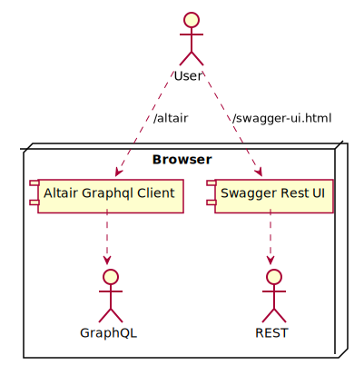

<!-- @head-content@ -->
# laplacian-tutorial/application-model

The application-model project.


*Read this in other languages*: [[日本語](README_ja.md)] [[简体中文](README_zh.md)]
<!-- @head-content@ -->

<!-- @toc@ -->
## Table of contents
- [Usage](#usage)

- [Index](#index)

  * [Script List](#script-list)

  * [Source code list](#source-code-list)

- [Architecture overview](#architecture-overview)


<!-- @toc@ -->

<!-- @main-content@ -->
## Usage

To apply this Model module, add the following entry to your project definition.
```yaml
project:
  models:
  - group: laplacian-tutorial
    name: application-model
    version: 0.0.1
```

You can run the following command to see a list of resources affected by the application of this module and their contents.
```console
$ ./script/generate --dry-run

diff --color -r PROJECT_HOME/.NEXT/somewhere/something.md PROJECT_HOME/somewhere/something.md
1,26c1,10
< content: OLD CONTENT
---
> content: NEW CONTENT
```

If there is no problem, execute the following command to reflect the change.
```console
$ ./script/generate

```


## Index


### Script List


- [./script/generate.sh](<./scripts/generate.sh>)

  Generates the resources in each directory of `src/` `model/` `template/` in this project.
  The results are reflected in each directory of `dest/` `doc/` `script/`.

  *Generator input files*

  - `src/`
    Stores static resources that are not processed the generator.
    The contents of this directory are copied directly into the `dest/` directory.

  - `model/`
    Stores the static model data files written in *YAML* or *JSON* format used for the generation.

  - `template/`
    This directory contains the template files used for the generation.
    Files with a extension `.hbs` will be handled as templates. All other files are copied as is.

    - `template/dest` `template/doc` `template/scripts`
      Each of these directories contains the template files of the resource to be output
      in the directory `dest/` `doc/` `scripts`.

    - `template/model` `template/template`
      These directories store template files updating the contents of `template/` and `model/` used for the generation.
      If the content of `template/` `model/` is updated as a result of the generation,
      the generation process is executed recursively.
      The changes to `template/` `model/` that occur during the above process are treated as an intermediate state
      and will be lost after the completion of the process.
      Use the *--dry-run* option to check these intermediate files.

  *Generator output files*

  - `dest/`
    Outputs the source files of applications and modules created as the result of
    the generation process.

  - `doc/`
    Outputs the project documentation.

  - `scripts/`
    Outputs various scripts used in development and operation.

  > Usage: generate.sh [OPTION]...
  >
  > -h, --help
  >
  >   Displays how to use this command.
  >   
  > -v, --verbose
  >
  >   Displays more detailed command execution information.
  >   
  > -d, --dry-run
  >
  >   After this command is processed, the generated files are output to the `.NEXT` directory
  >   without reflecting to the folders of `dest/` `doc/` `scripts/`.
  >   In addition, the difference between the contents of the `.NEXT` directory and the current files.
  >   This directory also contains any intermediate files created during the generation.
  >   
  > -r, --max-recursion [VALUE]
  >
  >   The upper limit of the number of times to execute recursively
  >   when the contents of the `model/` `template/` directory are updated
  >   during the generation process.
  >    (Default: 10)
  > , --local-module-repository [VALUE]
  >
  >   The repository path to store locally built modules.
  >   The modules in this repository have the highest priority.
  >   
  > , --updates-scripts-only
  >
  >   Updates script files only.
  >   This option is used to generate the generator script itself
  >   when the project is initially generated.
  >   
- [./script/publish-local.sh](<./scripts/publish-local.sh>)

  After the resources in the project are generated,
  the resources in the `./dest` directory are built as a model module
  and registered in the local repository.

  > Usage: publish-local.sh [OPTION]...
  >
  > -h, --help
  >
  >   Displays how to use this command.
  >   
  > -v, --verbose
  >
  >   Displays more detailed command execution information.
  >   
  > -r, --max-recursion [VALUE]
  >
  >   This option is the same as the option of the same name in [generate.sh](<./scripts/generate.sh>).
  >    (Default: 10)
  > , --skip-generation
  >
  >   This option is the same as the option of the same name in [generate.sh](<./scripts/generate.sh>).
  >   
  > , --local-module-repository [VALUE]
  >
  >   The path to the local repository where the built module will be stored.
  >   If the repository does not exist in the specified path, it will be created automatically.
  >   
### Source code list


- [model/project.yaml](<./model/project.yaml>)

## Architecture overview


The following diagram illustrates how major components in this system are wired.



<!-- @main-content@ -->